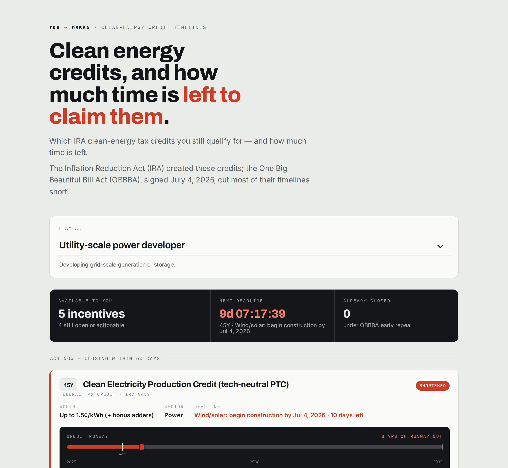

# Clean Energy Credit Finder

**Pick who you are → see which IRA clean-energy tax credits you still qualify for, what they're worth, who's eligible, and how much time is left to claim them.**



The Inflation Reduction Act (IRA) created a suite of clean-energy tax credits. The **One Big Beautiful Bill Act (OBBBA)**, signed July 4, 2025, cut most of their timelines short — repealing some early, shortening others, and improving or extending a few. This tool translates that mess into a single question: *given who you are, what's still available and when does it close?*

It's a single-page static site — **everything is inlined in one `index.html`** (styles, data, and logic), so there are no dependencies and nothing to build. Open the file and it works.

## What it does

- A dropdown to choose your role (homeowner, EV buyer, home builder, commercial building owner, fleet operator, utility-scale developer, manufacturer, clean-fuel/hydrogen producer, carbon-capture operator).
- The credits and programs you may qualify for, **sorted by urgency** — closing soonest first, already-closed last.
- For each one: dollar value, who qualifies, the operative deadline, and a **runway timeline** showing the original IRA end date (ghost) versus the shortened OBBBA end date (solid stop), with a live "today" marker.
- A live countdown to your single nearest deadline.

> **This is an educational summary, not tax or legal advice.** Dates, dollar values, and eligibility rules are simplified. Confirm current rules with the IRS and a qualified tax professional before acting. Data reflects OBBBA as reported through early 2026.

## Run it locally

Just open the file:

```
open index.html        # macOS
xdg-open index.html    # Linux
```

Everything is embedded in `index.html`, so it runs straight from `file://` with no server. If you'd rather serve it:

```
python3 -m http.server 8000
# then visit http://localhost:8000
```

## Deploy to GitHub Pages

1. Push this folder to a GitHub repo.
2. **Settings → Pages → Source: Deploy from a branch**, pick `main` / root.
3. Your site goes live at `https://<you>.github.io/<repo>/`.

No build action is required — it's a single static HTML file. (`.nojekyll` is included as a harmless safeguard.)

After deploying, update the GitHub link in `index.html` (`id="repo-link"`) to point at your repo.

## Editing the data

`build_data.py` is the **single source of truth**. Edit the `items` list there, then regenerate both data files:

```
python3 build_data.py
```

This rewrites `data/credits.json` (raw data for reuse) and re-injects the data into the `window.CE_DATA = …` block inside `index.html` (between the `/* CE_DATA_START */` … `/* CE_DATA_END */` markers). Don't hand-edit that block — it's generated.

Each credit/program record looks like:

```python
{
  "code": "48E",
  "name": "Clean Electricity Investment Credit (tech-neutral ITC)",
  "kind": "credit",            # "credit" or "program"
  "sector": "Power",
  "personas": ["utility", "commercial"],
  "value": "6–30% of project cost (+ bonus adders)",
  "ira_end": 2035,             # original IRA end year (the ghost marker)
  "obbba_end": 2027,           # revised OBBBA end year (the solid stop)
  "status": "Shortened",       # Repealed early | Shortened | Mixed | Preserved | Improved | Extended | Active | Rescinded | Restructured
  "deadline_label": "Wind/solar: begin construction by Jul 4, 2026",
  "deadline_date": "2026-07-04",  # operative cutoff (ISO) for urgency math; null if no near deadline
  "eligibility": "Owners of zero-emission generation or storage projects…",
  "notes": "Wind & solar must begin construction by Jul 4, 2026 AND be placed in service by Dec 31, 2027…",
  "source_url": "https://www.mcguirewoods.com/…",   # citation shown on the card
  "source_label": "McGuireWoods (Jun 2026): beginning-of-construction ruling"
}
```

Source links are assigned by code in the `SOURCES` map near the bottom of `build_data.py`, so several credits can share one citation (e.g. all the credits covered by the IRS FAQ point to IRS Fact Sheet 2025-5). Credits with no entry in the map simply render without a source line.

Each card also shows a **"Verified" date** so users can see how fresh the figures are. Set the default in `build_data.py` by editing the `VERIFIED = "YYYY-MM-DD"` constant when you do a re-check, or override a single credit by adding a `"verified": "YYYY-MM-DD"` key to that item. After your quarterly review, bump `VERIFIED` and run `python3 build_data.py`.

Urgency buckets are computed from `deadline_date` against today's date, so the tool stays accurate over time without code changes:

| Bucket | Rule |
| --- | --- |
| Act now | 0–60 days left |
| Plan ahead | 61–365 days left |
| Still open | > 365 days, or `Preserved` / `Improved` / `Extended` / `Active` |
| Closed | deadline already passed |
| Context | `Rescinded` / `Restructured` programs (shown last, muted) |

## Project structure

```
clean-energy-credit-finder/
├── index.html            # the entire app — styles, data, and logic inlined
├── data/
│   └── credits.json      # generated — raw data for programmatic reuse
├── build_data.py         # SINGLE SOURCE OF TRUTH for the dataset
├── LICENSE               # MIT
└── README.md
```

The CSS and JavaScript live directly inside `index.html`. Only the dataset is generated, by `build_data.py`.

## Contributing

Corrections to deadlines, dollar values, eligibility, or sources are very welcome — this is exactly the kind of thing that benefits from many eyes.

1. Edit the relevant record in `build_data.py`.
2. Run `python3 build_data.py`.
3. Open a pull request and cite a primary source (IRS guidance, the statute, or a reputable legal/tax summary) for the change.

Please keep eligibility descriptions plain-language and avoid implying that the tool gives individualized tax advice.

## Sources

Compiled from public reporting on OBBBA's changes to IRA provisions, including IRS OBBBA FAQs, Steptoe, Grant Thornton, CESA, Arnold & Porter, McGuireWoods, Holland & Knight, Third Way, the Columbia Climate Law Blog, Clifford Chance, USGBC, and Nossaman (2025–2026). See `data/credits.json` → `meta.sources`.

## License

MIT — see [LICENSE](LICENSE). The dataset is provided for educational purposes only and is not tax or legal advice.
